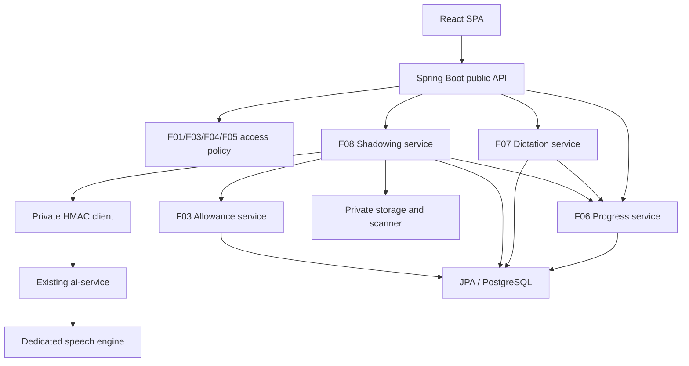

# Kế hoạch triển khai F06–F08: Lesson Player, Dictation và Shadowing

**Ngày rà soát:** 2026-09-11.  
**Phạm vi:** thiết kế và kế hoạch triển khai; chưa xác nhận tính năng đã được xây dựng hoặc kiểm thử thành công.  
**Mục tiêu:** đáp ứng yêu cầu MVP, xử lý nghiệp vụ xác định, bảo toàn dữ liệu khi retry/concurrency, code dễ đọc và kiểm chứng được.  
**Trạng thái:** thiết kế triển khai đề xuất. Chênh lệch tài liệu/schema tại mục 2 phải được giải quyết trước phần code phụ thuộc; việc ghi nhận gap chưa có nghĩa đã xử lý xong.

## 1. Căn cứ và phạm vi bắt buộc

### 1.1. Tài liệu phải đối chiếu

| Nguồn | Vai trò |
| --- | --- |
| [CONSTITUTION.md](CONSTITUTION.md), [AGENT.md](AGENT.md) | Luật dự án, stack, bảo mật, schema và Definition of Done |
| [CLAUDE.md](CLAUDE.md) | Clean Layered / Package-by-Feature, ranh giới module, encryption, retention, vận hành |
| [F03 spec](specs/F03-plans-entitlement-ai-allowance/spec.md), [F05 spec](specs/F05-course-catalog-access/spec.md) | Free-only MVP, entitlement/allowance và cửa vào bài học |
| [F06 spec](specs/F06-lesson-learning-progress/spec.md), [plan](specs/F06-lesson-learning-progress/plan.md), [tasks](specs/F06-lesson-learning-progress/tasks.md), [data model](specs/F06-lesson-learning-progress/data-model.md), [OpenAPI](specs/F06-lesson-learning-progress/contracts/f06-openapi.yaml) | Playback, watermark, tiến độ tuần tự |
| [F07 spec](specs/F07-dictation-practice/spec.md), [plan](specs/F07-dictation-practice/plan.md), [tasks](specs/F07-dictation-practice/tasks.md), [data model](specs/F07-dictation-practice/data-model.md), [OpenAPI](specs/F07-dictation-practice/contracts/f07-openapi.yaml) | Dictation deterministic, attempt, retake, history |
| [F08 spec](specs/F08-shadowing-practice/spec.md), [plan](specs/F08-shadowing-practice/plan.md), [tasks](specs/F08-shadowing-practice/tasks.md), [data model](specs/F08-shadowing-practice/data-model.md), [OpenAPI](specs/F08-shadowing-practice/contracts/f08-openapi.yaml) | Recording lifecycle, speech engine, quota, privacy |
| [DATA_short.md](DATA_short.md), [schema ban đầu](supabase/migrations/20260905143053_initial_schema.sql), [API.md](API.md) | Bằng chứng schema/API trong repo; khi triển khai phải đối chiếu thêm DB và lịch sử migration thực tế |

Không dùng kế hoạch này để sửa ngầm yêu cầu sản phẩm. Constitution vẫn ràng buộc; clarification cụ thể của feature giới hạn phạm vi MVP so với mô tả tổng quát trong CLAUDE. Khi có mâu thuẫn, ghi quyết định và cập nhật nguồn liên quan trước khi code dựa trên quyết định đó. Các spec hiện còn ghi `Draft`; không tự đổi thành `Approved`.

### 1.2. Phạm vi sản phẩm

- **F06:** learner đã đăng nhập mở Player của lesson được phép; học theo thứ tự; chỉ playback hợp lệ tới cuối mới complete segment; được xem lại segment đã hoàn thành.
- **F07:** luyện trong Player; chỉ current/completed segment phù hợp loại Dictation; simplified Hanzi, điểm 100/0; không gọi AI hoặc tiêu thụ allowance.
- **F08:** màn hình riêng giữ lesson/segment context; chỉ current/completed segment phù hợp loại Shadowing; audio được kiểm tra trước khi speech engine đánh giá qua private ai-service.
- F07/F08 chỉ cập nhật practice metrics được phép; không sửa `current_segment_id`, `completed_segment_count`, `completion_percent` hoặc completion status.
- **Free-only MVP:** F03/F05 không có hành trình mua Premium hoặc Premium lock/upgrade trong catalog. Guest chỉ xem summary, không vào Player/practice. Backend dùng access policy tập trung, không cho nội dung `PREMIUM` vô tình lọt vào MVP.
- Không thêm microservice, Kafka, Redis, API Gateway, Mastra Memory, dashboard đọc learner-private data hoặc chấm phát âm bằng LLM.

### 1.3. Stack và chuẩn code

Java 21, Spring Boot 3.4.5, Spring Data JPA, PostgreSQL 18; React 18 + JavaScript/JSX + Vite + Tailwind 3.x; ai-service Node.js/TypeScript/Mastra hiện có. Giữ dependency/lockfile hiện tại; chỉ thêm thư viện khi adapter thực sự cần và đã kiểm chứng.

- Controller: DTO + Bean Validation + HTTP mapping. Application service: use case, authorization, transaction. Domain policy: thuật toán thuần. Repository: JPA. Infrastructure: crypto/storage/scanner/private HTTP/provider.
- Không trả JPA entity hoặc nhận userId/score/access decision từ client làm nguồn tin cậy; identity lấy từ principal.
- Constructor injection, tên theo nghiệp vụ, một đường xử lý thành công rõ ràng, guard clause cho lỗi. Không tạo generic framework/interface cho mọi class nếu không có ranh giới thay thế thật.
- Inject `Clock`, ID generator và external adapters để test thời gian/lỗi. Dùng `Instant` UTC, milliseconds bằng `long`, score theo precision schema.
- Không nuốt exception; không catch uniqueness rồi tiếp tục transaction rollback-only; retry toàn bộ transaction ngắn khi cần.
- Không raw SQL trong application code. Mọi schema work theo mục 2.2; không tự tạo migration chỉ vì thấy field thiếu.

## 2. Giai đoạn 0 — Đối chiếu và khóa thiết kế

### 2.1. Gap register và quyết định

| ID | Bằng chứng/rủi ro hiện tại | Quyết định và đầu ra bắt buộc |
| --- | --- | --- |
| G01 | Chưa thấy module catalog F05 trong mã nguồn đã rà soát; có content/media admin và entitlement | Xác nhận trạng thái F05. Hoàn thành/tích hợp access/read facade và catalog hand-off trong F05; không dùng API Admin cho learner. E2E phải chạy qua đường vào thật. |
| G02 | API bản kế hoạch cũ khác ba OpenAPI | Giữ route mục 4; đồng bộ DTO/OpenAPI/API.md/client cùng thay đổi, không duy trì API lồng lesson/segment thứ hai. |
| G03 | F06 contract thiếu trường UI/ordering; schema chưa có watermark bền vững | Bổ sung state/contract mục 4–5 trước code; không dùng memory map để bảo đảm resume qua restart. |
| G04 | DB có `recordings`; F08 data-model/tasks gọi `shadowing_recordings` | Tái sử dụng `recordings`, không tạo bản sao. Đồng bộ data-model/tasks và FK owner/context trước attempt. |
| G05 | DB shadowing status khác PROCESSING/COMPLETED/FAILED/EXPIRED của contract | Domain/API theo F08 contract; thiết kế mapping/backfill mục 3, không đổi enum JPA trên CHECK constraint cũ. |
| G06 | DB có tone_score; F08 contract/research dùng pronunciation/rhythm/fluency; bản cũ cam kết IPA từng từ | Core response theo OpenAPI, không gán tone thành fluency; giữ dữ liệu tone cũ. Spike G10 quyết định extension tone/IPA có schema, không tạo điểm giả hoặc bỏ yêu cầu IPA tổng quát mà không ghi nhận. |
| G07 | ConversationCryptoService nhận AiConversationEntity, chưa có resource API độc lập | Trích xuất envelope service chung, giữ facade và khả năng giải mã F11 cũ. Resource DEK + AAD owner/resource/field/version. |
| G08 | ai-service server chỉ nhận AI Buddy, body 64 KB; HMAC cố định path AI Buddy | Mở rộng router/verifier theo allowlist, giới hạn audio riêng, giữ JSON limit cũ. Test multipart signature và F11 vector regression. |
| G09 | AiAllowanceService có reserve/succeed/refund nhưng chưa đủ bằng chứng race/crash safety | Kiểm chứng atomic reserve/settlement, cycle và terminal-state race; F03 vẫn là authority, không thêm ledger F08 riêng. |
| G10 | Chưa chốt speech engine/scanner/storage và codec thực tế | Spike với audio được phép sử dụng: zh-CN, dimensions, IPA/tone, codec/duration, timeout, retention và no-training/no-transcript. Chốt adapter/config cụ thể trước bật F08. |
| G11 | AGENT yêu cầu DATA/_short.md nhưng repo có DATA_short.md; MigrationIT đọc supabase/migrations, tasks cũ ghi đường dẫn khác | Xác nhận nguồn schema và migration mechanism theo mục 2.2; không tự tạo migration folder thứ hai hoặc số V008 từ task cũ. |
| G12 | CLAUDE mô tả Guest playback/Premium rộng hơn F03/F05; feature API dùng safe 404 | Đồng bộ notes về Free MVP, guest chỉ summary và error contract; không thêm upgrade hoặc tự đổi thành 403 ngoài hợp đồng. |

**G0 hoàn tất khi:** mỗi G01–G12 có người phụ trách, quyết định, file cần đồng bộ và bằng chứng. Không ghi PASS chỉ vì đã có phương án. G10 có thể tiến hành trong lúc xây F06/F07, chỉ chặn phần F08 phụ thuộc adapter.

### 2.2. Quy tắc schema/migration

Đây là nhu cầu dữ liệu để review, không phải migration đã được phê duyệt. AGENT.md yêu cầu đọc `DATA/_short.md`; nếu thiếu nguồn/đối tượng cần thiết phải báo gap và có chấp thuận rõ ràng trước khi thêm migration. Việc cập nhật kế hoạch hiện tại không tạo migration.

1. Xác nhận DATA_short.md có phải nguồn thay thế được công nhận; đối chiếu schema thực tế/lịch sử migration trong môi trường được phép, không chỉ suy ra từ SQL ban đầu.
2. Lập bảng existing/required: column/type/nullability/unique/FK/CHECK/index/backfill/ảnh hưởng dữ liệu cũ. Không sửa schema snapshot như thể DB đã được cập nhật.
3. Sau khi schema design và cơ chế triển khai được thống nhất, thêm forward migration tập trung cho thay đổi schema chưa merge; không sửa/xóa migration đã áp dụng.
4. Test clean database và upgrade từ dữ liệu đại diện; kiểm tra checksum/orphan/duplicate/enum và ứng dụng chuyển tiếp đọc được dữ liệu.
5. Dữ liệu cũ thiếu bằng chứng playback/assessment: giữ lịch sử, không tự cấp watermark, completion, score hoặc usage event. Không tăng completion/quota bằng backfill.

## 3. Kiến trúc và dữ liệu

### 3.1. Ranh giới module



F06 là dependency chung; F07/F08 không gọi nhau. Thứ tự giao hàng ưu tiên F06 → F07 → F08 để giảm rủi ro; không có dependency kỹ thuật F07 → F08.

| Package | Thành phần/trách nhiệm |
| --- | --- |
| content/application | LearningContentAccess trả snapshot bất biến về lesson/segment được phép, semantic revision và media eligibility |
| progress/api | LessonPlaybackController, LessonProgressController, explicit DTO |
| progress/application | LessonProgressService, PlaybackEventService, PracticeMetricsService; độc quyền sửa progress |
| progress/domain | PlaybackPolicy, SequentialProgressPolicy, PlaybackCapabilityClaims, PermittedSegment; không HTTP/DB |
| progress/persistence | LessonProgressEntity, repository/projection query |
| dictation/{api,application,domain,persistence} | Controller/service, DictationEvaluator, attempt entity/repository |
| shadowing/{api,application,domain,persistence,infrastructure} | Recording/attempt services, state policies, worker, retention job, private client |
| security/crypto | User/resource envelope service; ConversationCryptoService facade giữ tương thích F11 |
| storage hoặc shadowing/infrastructure | Chốt một vị trí cho recording storage/scanner ở G10; không tạo hai abstraction cùng việc |

Giao diện nội bộ rõ nghĩa: `requirePracticeable(userId, segmentId, practiceType)`, `recordApprovedDictationOutcome(outcome)`, `recordApprovedShadowingOutcome(outcome)`. Outcome có attemptId/owner/context/validated score; không dùng hàm nhận hai score nullable để đoán loại bài tập. Module trao đổi DTO/value object, không sửa entity/repository của nhau.

### 3.2. Dữ liệu cần đối chiếu trước mapping

| Aggregate | Hiện có và nhu cầu thiết kế |
| --- | --- |
| lesson_progresses | Có unique user/lesson, counters, best scores, practice_seconds, version. Cần watermark, last position/time, remaining playback budget, playback generation, last sequence/event fingerprint, semantic revision và phần milliseconds chưa tròn giây. |
| dictation_attempts | Giữ owner/lesson/segment FK, ciphertext, timestamps, version. Cần submission ID/fingerprint, resource wrapped DEK/crypto version, reference revision; unique logical submit theo user và tối đa một IN_PROGRESS trên user/segment. |
| recordings | Giữ classification/status, locator ciphertext, checksum, MIME/size/duration, scan/expiry timestamps. Cần resource DEK, learning context trước assessment và scan/version binding; locator không vào DTO. |
| shadowing_attempts | Giữ unique recording, owner FK, usage link, score/feedback. Cần request ID/fingerprint, domain lifecycle, fluency nếu thiếu, safe failure, deadline, dispatch/claim marker, resource key và content revision. |
| ai_usage_events | Tái sử dụng F03, SHADOWING_ASSESSMENT, owned operation = attempt UUID. Kiểm tra unique user/request, reservation cycle identity, concurrent terminal guard. |
| Content revision | Revision có nghĩa học tập, đổi khi order/timing/reference/media thay đổi; không lấy progress.version hoặc riêng lesson.version đại diện mọi thay đổi segment/media. |

Không nhất thiết mỗi khái niệm trên là một column riêng: G0 chọn mapping nhỏ nhất bảo toàn invariant. Không thêm bảng event log vô hạn chỉ để xử lý heartbeat.

| DB shadowing cũ | Domain/API mới | Điều kiện chuyển |
| --- | --- | --- |
| EVALUATED | COMPLETED | Kết quả hợp lệ; giữ usage/score cũ, không gọi provider lại |
| FAILED | FAILED | Giữ safe reason và settlement đã xác nhận |
| IN_PROGRESS/SUBMITTED | PROCESSING hoặc EXPIRED | Chỉ resume khi đủ identity/eligibility/deadline; thiếu bằng chứng đi reconciliation, không blind dispatch |
| DELETED | Tombstone/ẩn khỏi history | Không đổi máy móc thành EXPIRED; deletion khác processing timeout |

Recording hết retention không đổi assessment COMPLETED thành EXPIRED. Kết quả tối thiểu theo learning-data retention riêng.

Dữ liệu EVALUATED cũ thiếu fluency không được backfill từ tone hoặc số 0. Nếu vẫn đủ điều kiện trả historical overall score, `dimensions` có thể null đúng nullable schema hiện tại; UI hiển thị không có phân tích chi tiết cho bản cũ. Assessment mới chỉ COMPLETED khi đủ core dimensions. Mọi chuyển đổi thiếu bằng chứng đi reconciliation, không sửa lịch sử bằng score được suy đoán.

## 4. Hợp đồng API

### 4.1. Public endpoints chuẩn

Tất cả route dưới `/api/v1`, dùng `{ success, data, error, meta }`, meta.correlationId, JWT/session hiện hành và explicit DTO.

| Feature | Method/path | Input | Kết quả |
| --- | --- | --- | --- |
| F06 | GET /lessons/{lessonId}/playback | lessonId | 200 playback/progress; chỉ entry này lazy-create |
| F06 | GET /lesson-progress?lessonId=... | lessonId | 200 owned state hoặc projection NOT_STARTED, không insert |
| F06 | POST /lesson-progress/{lessonId}/playback-events | segmentId/event/positionMs/clientEventId/playbackCapability | 200 latest progress hoặc safe error |
| F07 | POST /dictation-attempts | segmentId | 201 create/reuse IN_PROGRESS theo contract |
| F07 | POST /dictation-attempts/{attemptId}/submit | answer/clientSubmissionId | 200 deterministic result hoặc replay |
| F07 | GET /dictation-attempts | lessonId/segmentId/page/size | 200 owned history, size ≤ 50 |
| F07 | GET /dictation-attempts/{attemptId} | attemptId | 200 safe owned detail |
| F08 | POST /recordings | multipart file + segmentId | 201 metadata/status, không quota |
| F08 | POST /shadowing-attempts | segmentId/recordingId/clientRequestId | 202 PROCESSING hoặc replay; reserve chỉ khi AVAILABLE |
| F08 | GET /shadowing-attempts | lessonId/segmentId/page/size | 200 owned history, size ≤ 50 |
| F08 | GET /shadowing-attempts/{attemptId} | attemptId | 200 PROCESSING/COMPLETED/FAILED/EXPIRED và safe result |

Không có API complete thủ công. Polling GET không khởi động provider, retry assessment hoặc trừ quota.

### 4.2. Contract bổ sung phải đồng bộ ở G0

OpenAPI hiện tại là baseline; các bổ sung dưới đây **chưa tồn tại** và phải cập nhật OpenAPI/API.md/spec technical notes trước khi viết client:

1. F06 event thêm `eventSequence` số nguyên dương để loại event cũ bằng state hữu hạn; projection thêm progressVersion, totalSegmentCount, completionPercent, best scores, practiceSeconds, lastAcceptedEventSequence. Generation nằm trong signed token, sequence reset khi generation mới.
2. F06 playbackMetadata phải là allowlist schema audio/YouTube với start/end milliseconds, không object tùy ý. Completed lesson dùng read-only replay capability, current vẫn null. Locked chỉ placeholder được phép, không transcript/media.
3. F08 thêm owner-only `GET /recordings/{recordingId}` cho scan polling, expiry và safe failure. POST upload một lần chưa đủ biết scan đã hoàn tất.
4. Recording control: giữ route canonical trong CLAUDE là owner-only `DELETE /me/recordings/{recordingId}`: ẩn ngay rồi queue deletion, không tạo route delete thứ hai. Consent dùng `PUT/DELETE /me/consents/{purpose}` với purpose RECORDING_RETENTION theo policy. Bổ sung `PUT /me/recordings/{recordingId}/retention` để save một recording cụ thể, body `classification: SAVED_RECORDING` và `expectedVersion`; server kiểm tra consent/version hiện hành, không tin client tự khẳng định đã consent. Các endpoint được đặc tả và kiểm tra tồn tại trước tích hợp. Default ASSESSMENT_ONLY; Save chỉ bật khi lifecycle sẵn sàng.
5. F08 thêm safe failureCode/processing deadline; core dimensions giữ pronunciation/rhythm/fluency. Tone/IPA extension chỉ sau G10, có type/bounds/nullability và test; không forward response provider tùy ý.
6. Bổ sung 429 RATE_LIMITED cho endpoint có throttle, 413 upload quá giới hạn; map envelope và enum/status đầy đủ. F07/F08 public idempotency conflict là 409 STATE_CONFLICT; map IDEMPOTENCY_CONFLICT nội bộ F03 tại adapter.

### 4.3. Authorization/error rules

- 401: credential thiếu/hết hạn/revoked/không hợp lệ; tái sử dụng F01 filter.
- 404 RESOURCE_NOT_FOUND: tài nguyên không tồn tại, không owned hoặc không được phép theo feature contract; không tiết lộ lý do giúp dò dữ liệu khác.
- 400 VALIDATION_ERROR: payload/type/position/capability không hợp lệ; 409 STATE_CONFLICT: stale generation/content hoặc key tái sử dụng sai.
- 429 AI_QUOTA_EXCEEDED: hiển thị quota/kỳ reset từ F03, không tự mua/nâng cấp hoặc retry liên tục.
- 502/503: provider/private failure được chuẩn hóa. Operation đã trả 202 thì lỗi tiếp theo nằm trong attempt state; GET trạng thái vẫn 200.
- Learner-private response dùng Cache-Control: no-store; DTO không chứa answer key, raw audio, recognized transcript, locator, secrets. ADMIN không được đọc dữ liệu người khác chỉ vì role.

## 5. F06 — Player và tiến độ có thẩm quyền phía server

### 5.1. Invariant nghiệp vụ

| ID | Invariant |
| --- | --- |
| P01 | Một progress/user/lesson; catalog, summary, history và GET progress không tạo progress |
| P02 | Entry đầu: NOT_STARTED/count 0/current là segment đầu theo thứ tự; IN_PROGRESS chỉ sau positive playback được xác nhận |
| P03 | Chỉ current được complete; completed được replay; future locked không có practice/playback payload |
| P04 | Complete tăng count một lần, unlock đúng đoạn kế tiếp; final current null/count = total/percent = 100 |
| P05 | Watermark tăng đơn điệu trong current segment; rewind không giảm watermark; chuyển segment reset watermark |
| P06 | F07/F08 không sửa completion/unlock; replay/concurrent ENDED không tăng completion hoặc practice lần hai |
| P07 | Availability thay đổi chặn resource access kế tiếp, giữ progress/history cũ |

### 5.2. Mở/resume Player

1. Principal → access facade kiểm tra topic/lesson/segment/media publication, Free MVP, media approval/scan theo loại nguồn.
2. Đọc ordered manifest bằng projection, validate có segment và end > start. Không bỏ qua current segment unavailable để mở đoạn sau.
3. Lazy-create trong transaction ngắn có unique user/lesson. Hai entry insert: transaction thua rollback, đọc row thắng trong transaction mới.
4. So semantic revision: title không ảnh hưởng nội dung có thể giữ revision; order/timing/reference/media thay đổi làm token cũ vô hiệu. Nếu cấu trúc mới không ánh xạ an toàn với contiguous progress cũ, trả unavailable; không reset hoặc tính completion theo số segment mới. Chuyển progress sang revision mới cần thiết kế F04/F06 riêng trước khi cho tiếp tục bản nội dung đó.
5. Cấp HMAC capability 15 phút có iss/aud/purpose, user/session binding, lesson/segment/scope, content revision, generation, iat/exp/kid. TTL là cấu hình, không thay access recheck; xác minh algorithm/key allowlist.
6. Chỉ một generation có quyền **advance** trên user/lesson tại một thời điểm. Entry/refresh takeover đổi generation trong transaction, giữ watermark, reset time anchor/sequence. Thiết bị cũ reload khi stale. Duplicate ENDED đoạn completed chỉ trả latest sau validation phù hợp, không complete current mới.
7. DTO chỉ trả metadata current/completed được phép và locked placeholder. Không đưa transcript_hanzi vào payload mặc định của Player/Dictation chỉ vì entity có field này.

### 5.3. Thuật toán watermark

**Giới hạn bảo đảm:** server kiểm chứng access/thời gian/giao thức; browser event không chứng minh người dùng thực sự nghe/chú ý. Watermark bảo vệ completion của Pchinese, không phải DRM ngăn xem nguồn YouTube ở nơi khác. Không ghi claim chống gian lận tuyệt đối.

Cấu hình khởi đầu để đo ở G0: heartbeat 2 giây khi phát, maxHeartbeatGap 5 giây, tốc độ advance MVP 1x. Dùng typed config, không magic number rải rác. Dùng time-credit bucket hữu hạn để hấp thụ jitter: chỉ tích lũy từ thời gian server chưa tiêu thụ, khởi tạo 0, cap bằng maxHeartbeatGap × rate. Không cộng tolerance miễn phí mỗi heartbeat hoặc mỗi lần refresh vì có thể tích lũy thành tiến độ giả.

State active generation: lastAcceptedSequence, lastEventId/fingerprint, lastAcceptedPositionMs, maxPlayedMs, lastAcceptedAt, remainingBudgetMs, validatedPracticeMs. positionMs là offset trong segment, không phải timestamp tuyệt đối của video. Generation bắt đầu tại last confirmed position và budget 0, tuyệt đối không nhận starting position tùy ý từ client.

Xử lý trong một transaction serialize trên progress row:

```text
validate identity/access/token signature/scope/expiry/content revision
load locked progress and permitted segment context
if event targets an already completed segment:
    return latest without mutation; never apply it to the new current segment
require current segment and active advance generation
if sequence < lastAcceptedSequence:
    return latest without mutation
if sequence == lastAcceptedSequence:
    same eventId + fingerprint => return latest
    changed payload => STATE_CONFLICT
require sequence == lastAcceptedSequence + 1
require 0 <= positionMs <= segmentDurationMs

effectiveNow = max(serverNow, lastAcceptedAt)   # clock cannot move anchor backwards
elapsedMs = effectiveNow - lastAcceptedAt
if elapsedMs > maxHeartbeatGapMs:
    return resync conflict without changing confirmed progress

budgetCapMs = maxHeartbeatGapMs * allowedRate
availableBudgetMs = min(budgetCapMs, remainingBudgetMs + elapsedMs * allowedRate)
forwardDeltaMs = max(0, positionMs - lastAcceptedPositionMs)
require forwardDeltaMs <= availableBudgetMs
if event == ENDED:
    require positionMs == segmentDurationMs

remainingBudgetMs = availableBudgetMs - forwardDeltaMs
maxPlayedMs = max(maxPlayedMs, positionMs)
validatedPracticeMs += forwardDeltaMs
update position, sequence, fingerprint and lastAcceptedAt = effectiveNow
if first accepted positive playback: NOT_STARTED -> IN_PROGRESS
if event == ENDED:
    require maxPlayedMs == segmentDurationMs
    complete current once; advance or finalize
return latest projection
```

- Một event request đang chờ tại một thời điểm; timeout retry giữ eventId/sequence/body. Sequence cũ được bỏ qua, không cần lưu lịch sử heartbeat vô hạn; payload conflict được kiểm tra cho sequence cuối đã nhận. Mọi sequence đã cũ không thể tạo tác dụng phụ dù body bị đổi.
- Tổng forwardDelta được chấp nhận không vượt tổng credit thời gian server của generation; duplicate không cấp thêm credit. Test heartbeat jitter sớm/muộn, burst request, refresh lặp và clock lùi để kiểm chứng invariant này. Bucket hấp thụ jitter bằng credit có thật, không tăng tốc nghe cho learner.
- Pause ngừng heartbeat; resume sau gap dài refresh capability rồi seek về vị trí server xác nhận. Mạng chậm/đổi tab không xóa progress đã xác nhận. Không queue offline để cộng tiến độ hàng loạt; server clock lùi không tạo credit.
- Rewind cập nhật vị trí thấp hơn, watermark giữ nguyên; khi phát tiến lên vẫn dùng budget. UI chỉ seek trong watermark; không dùng UI làm authority. Request từ chối không cộng thời gian.
- Player báo hết nhưng heartbeat cuối chưa tới duration: final progress/ENDED phải thỏa cùng budget, chuyển đoạn chỉ sau ACK. Không dùng epsilon để tự complete phần chưa phát.
- Practice time MVP đo khoảng phát tiến lên đã xác nhận trên active current segment, kể cả nghe lại; giữ phần lẻ ms rồi tính seconds, không làm tròn từng event. Không cộng thời gian gõ do client báo hoặc recording duration vào cùng tổng khi chưa có quy tắc chống đếm chồng. Replay completed segment không cộng tổng theo protocol này; ghi rõ metric scope trong API/UI notes ở G0.
- Percent = floor(10000 × completedCount / totalCount) / 100; 100 chỉ khi count = total. Total = 0 trả empty/unavailable, không chia 0; không round một lesson chưa xong thành 100.

### 5.4. Concurrency và hiệu năng

- JPA pessimistic row lock cho transition ngắn, @Version làm guard; không lock qua playback/media/network I/O. Completion và best-score serialize trên cùng progress row để không ghi đè.
- Next segment theo sequence thực tế, không giả định sequence liên tục +1. Manifest O(S) khi mở; event policy O(1), current/next query có index; không load toàn bộ history để tính progress.
- Unique DB là bảo vệ cuối cho lazy init; application check riêng không đủ. Không dùng synchronized để tuyên bố cross-instance safety.
- Content mutation F04 cần serialize hoặc semantic revision fence kiểm chứng được với F06 transition. Test sửa/unpublish trong lúc complete, không chỉ check ở đầu controller.

### 5.5. Player frontend

LessonPlayerPage/PlaybackControls/SegmentList dùng API client và hook điều phối event riêng; audio và YouTube có adapter cùng interface play/pause/position/seek/end. Spike adapter thật ở B04a; không giả định mọi nguồn có cùng event semantics.

State có loading/empty/ready/playing/paused/synchronizing/unavailable/error/completed; cleanup timer/listener/request khi unmount. Không tạo generation mới bởi render hoặc effect lặp không kiểm soát. Khi đổi generation/segment, loại response cũ bằng request context và progressVersion. Phải phát đến endMilliseconds của segment, không chờ toàn video ended. Refresh capability trước hết hạn với pause/resync có kiểm soát; không giữ player chạy vượt server ACK trong lúc đổi generation. Revisit completed không thay current, Dictation mở tại segment được chọn và Shadowing giữ cả lessonId/segmentId.

## 6. F07 — Dictation deterministic, retry và retake

### 6.1. Start/submit/history

1. Start: derive lesson từ segment; validate current/completed và DICTATION/BOTH/reference. Lock progress làm anchor, create/reuse đúng một IN_PROGRESS; snapshot reference revision, không trả đáp án.
2. Submit: owner/input/key validation. Cùng key/attempt/raw payload trả kết quả đã lưu; key đổi payload hoặc dùng cho attempt khác trả 409. Đọc replay vẫn phải kiểm tra owner và policy trả history.
3. Submit mới recheck availability/practiceability/reference revision. Reference đổi không silently chấm bằng đáp án khác: conflict và hướng dẫn start lại theo policy được đồng bộ.
4. Evaluator thuần chấm; encrypt learner answer; persist EVALUATED/score/accuracy/guidance/submission identity; update best qua Progress service trong cùng transaction ngắn.
5. Retake sau EVALUATED tạo attempt mới, giữ history cũ. Retry submit không tạo attempt hoặc gọi evaluator lần nữa.
6. History/detail dùng owner-scoped repository, page ≤ 50, sort createdAt DESC/id DESC. Không giải mã toàn bộ history hoặc expose answer key.

SUBMITTED có thể là trạng thái nội bộ transaction; public chỉ trả trạng thái đã cam kết. Invalid input rollback, không ghi FAILED chỉ vì validation lỗi. Deleted attempt không xuất hiện trong history thông thường. Nếu attempt reference cũ không còn dùng được, đóng attempt theo transition được định nghĩa trước khi start lại để không mắc kẹt ở unique IN_PROGRESS.

### 6.2. Thuật toán chuẩn hóa/chấm điểm

DictationEvaluator.evaluate(answer, expected) không gọi JPA/crypto/logger/network/Clock.

1. Validate raw answer 1–2000 theo contract trước normalize; reference phải hợp lệ. Chốt cách đếm độ dài Unicode thống nhất Java/JSON bằng contract test supplementary characters.
2. Normalize cả hai bằng Unicode NFC, duyệt **code point**, không từng Java char.
3. Loại Unicode whitespace (isWhitespace hoặc isSpaceChar) và punctuation Pc/Pd/Ps/Pe/Pi/Pf/Po. Không xóa mọi ký tự ngoài Hanzi vì có thể biến câu sai thành đúng.
4. Không chuyển Traditional → Simplified hoặc pinyin → Hanzi, không sửa character/order. Ký tự không thuộc nhóm bị loại vẫn có ý nghĩa.
5. Answer rỗng sau normalize trả validation error; reference rỗng là content-invalid, không chấm hai chuỗi rỗng thành 100.
6. Exact match → overallScore = accuracyPercent = 100; mismatch → cả hai 0. Guidance từ template/enum tiếng Việt ≤ 500 ký tự, không full answer/per-character diff.

Thời gian/bộ nhớ O(N + M) với input bounded; không Levenshtein O(NM), không AI, không normalize lại ở từng layer. Không cache answer key ở frontend. Chỉ cân nhắc bounded server cache theo revision sau khi đo thấy cần.

Fingerprint submit dùng keyed digest trên encoding không nhập nhằng của owner/attempt/reference revision/**raw answer**; không hash trần câu ngắn dễ dò từ điển và không log fingerprint. Answer khác punctuation có thể cùng điểm nhưng vẫn là payload khác nếu tái dùng key.

Best = max(oldBest, approvedScore), xử lý null và cập nhật trong transaction EVALUATED duy nhất. Không quét history mỗi submit; không cộng duration client. Transaction retry không tạo key mới, không chấm một logical submit đã commit lần nữa.

### 6.3. Frontend

DictationPanel ở Player, API client `frontend/src/api/dictation.js`; state nhập/chờ/kết quả/lỗi rõ ràng. Giữ submission key đến khi xác định kết quả. Disable submit chỉ là UX, backend vẫn chống trùng. Enter khi IME composition đang chọn chữ Hán không submit. Retake giữ selected segment; không tự chuyển đoạn khóa. Loading/error không xóa answer đang gõ; không lưu answer vào localStorage/telemetry.

## 7. F08 — Recording, assessment và settlement phục hồi được

### 7.1. Upload/scan

```text
recording: UPLOADING -> SCANNING -> AVAILABLE | QUARANTINED
           retained state -> DELETED through governed cleanup
attempt: PROCESSING -> COMPLETED | FAILED | EXPIRED
```

1. Auth/access/rate limit trước xử lý file; derive owner/context server-side. Segment phải SHADOWING/BOTH và current/completed trước khi tạo recording.
2. Cấu hình khởi đầu: file tối đa **10 MiB**, multipart body tối đa **11 MiB**; check Content-Length nếu có và byte thực nhận. Đồng bộ thông báo/biên test, không dùng mơ hồ <10MB.
3. MIME khai báo/container signature/decode phải khớp allowlist G10 chứng minh. Audio/webm, audio/wav, audio/mp4 là candidates, không phải hỗ trợ đã được xác minh. Reject rỗng/sai codec/truncated/decode quá tài nguyên.
4. Server xác định duration; G10 chốt min/max theo provider và bài mẫu, test silence/too-short/too-long. Không coi file nhỏ là hợp lệ hoặc lấy duration client làm authority.
5. Tạo ASSESSMENT_ONLY; encrypted storage/quarantine private. Object key server sinh, không dùng filename làm path; checksum/context binding bất biến sau upload.
6. Scanner adapter tin cậy có timeout. Chỉ CLEAN trên đúng recording/checksum/version được AVAILABLE. Scanner lỗi/không kết quả không fail-open. MediaScanService hiện có nhận scan result của media asset, không phải scanner audio hoàn chỉnh.
7. File lưu xong DB lỗi/upload ngắt phải cleanup object mồ côi. DB/storage không có transaction nguyên tử chung; không đưa SCANNING/QUARANTINED sang engine.
8. Frontend poll owned recording; chỉ AVAILABLE mới tạo assessment. Upload/scan/status/local preview không quota.

### 7.2. Tạo attempt/reserve — transaction T1

1. Validate owner/body; lookup user/clientRequestId. Cùng fingerprint/context trả attempt hiện tại, khác trả 409. Không tạo attempt UUID mới trước khi quyết định replay.
2. Request mới: recheck content, AVAILABLE/CLEAN/không expired, owner/context/checksum. Một recording chỉ có một attempt theo model.
3. Tạo UUID attempt ổn định và fingerprint recording/context/revision; unique recording và unique user/request tại DB, không chỉ application check.
4. Reserve F03 với SHADOWING_ASSESSMENT, ownedOperationId = attempt UUID, clientRequestId đã kiểm tra. F03 quyết quota/cycle 30 ngày; không hardcode allowance trong F08 hoặc xây billing mới.
5. Persist PROCESSING/usage link/deadline/dispatch state trong **cùng transaction** với reserve. Hết quota hoặc write fail rollback toàn T1; recording theo expiry riêng.
6. Commit → 202. Replay không enqueue provider lần nữa. reused=true không có nghĩa được gọi lại engine; phải đọc trạng thái ledger/attempt.

### 7.3. Dispatch/xử lý nền — ngoài transaction

- Worker nằm trong Spring Boot modular monolith, bounded executor + JPA polling PROCESSING đủ điều kiện. Attempt row là durable work source; không phụ thuộc duy nhất @Async/after-commit event dễ mất khi restart, không thêm queue service.
- Claim bằng JPA lock/version + claim token trong transaction ngắn. Không giữ DB transaction qua scan/storage/speech I/O; truy vấn batch có index.
- Claim chưa dispatch được reclaim sau lease timeout; mỗi lần claim mới tăng fencing generation. Worker cũ phải xác minh claim còn hiệu lực ngay tại transaction ghi dispatch marker. Claim đã có dispatch marker không được worker mới tự gọi provider lại; xử lý theo quy tắc kết quả không xác định bên dưới. Deadline và lease khác mục đích, không dùng một timestamp cho cả hai.
- Trước dispatch recheck recording/access/revision/account eligibility; persist dispatch-start marker rồi gọi private client với attempt UUID làm requestId ổn định.
- **Không hứa exactly-once provider execution qua mạng.** Crash sau dispatch/timeout không rõ kết quả: chỉ retry transport nếu provider/adapter đã chứng minh dedupe cùng requestId. Chưa có bảo đảm: không dispatch lại attempt, deadline → EXPIRED/refund một lần. User thử mới tạo recording/attempt mới rõ ràng.
- Finalize gặp transient DB error có thể retry transaction bằng response validated còn trong memory, không gọi speech engine lần nữa. Process chết mất response thì reconcile deadline/ledger, không đoán thành công.
- G10 chốt timeout: private/provider call kết thúc trước processing deadline; worker concurrency phù hợp memory/provider limit. Admission/circuit policy đơn giản nếu cần, không framework phân tán thừa.

### 7.4. Settlement — transaction T2

**Success:** đọc lại attempt/claim dưới lock → chỉ PROCESSING chưa terminal, recording/context còn eligible → validate score/feedback → encrypt feedback → COMPLETED → update shadowing best qua Progress → F03 succeed → cập nhật retention recording thành công → commit nguyên tử.

**Failure:** lỗi sau reserve mà không có kết quả hợp lệ → FAILED hoặc EXPIRED + safe failureCode → F03 refundOnce → cleanup schedule phù hợp → commit nguyên tử. Không broad catch để refund sau success đã commit.

Quy tắc concurrency:

- Terminal state không bị ghi đè bởi worker/cleanup/late response. T2 dùng trạng thái đọc lại dưới lock, không dựa entity cũ từ T1.
- F03 serialize succeed/refundOnce trên usage event. Hai entity đọc không khóa rồi cùng if RESERVED chưa đủ; refund giảm counter tối đa một lần.
- Rollover: refund gắn reservation cycle gốc, không giảm usage kỳ mới vì request kỳ trước timeout. Định nghĩa/test trong F03 trước F08.
- Global lock order cho multi-aggregate transaction: entitlement → usage event → progress → recording → attempt. Prefetch ID để tìm row, validate lại sau lock. F07 progress → attempt. Worker claim chỉ lock attempt rồi commit trước bước khác; không giữ attempt rồi quay ngược lấy entitlement.
- Nếu F03/F11 hiện dùng thứ tự khác, điều chỉnh common path có regression test; không tạo lock order chỉ đúng riêng F08. Bounded transaction retry không retry provider.

| Điểm lỗi | Hành vi bắt buộc |
| --- | --- |
| Trước T1 commit | Không usage/attempt dở dang; recording lifecycle riêng |
| Sau T1 commit, trước dispatch | Worker sau restart tìm được operation, không reserve lại |
| Sau dispatch, kết quả chưa xác định | Không blind retry; deadline/refund hoặc provider dedupe đã chứng minh |
| Output thiếu fluency bắt buộc/sai schema | FAILED/refund một lần, không chèn 0/default cho đủ schema |
| T2 commit nhưng client mất response | GET/retry trả COMPLETED đã lưu, không chấm lại |
| Cleanup/deletion thắng trước response | Loại late response, không restore recording/key hoặc update best |
| Worker/timeout job cùng finalize | Một terminal transition; ledger/progress/attempt nhất quán |

### 7.5. Private ai-service/speech engine

- Mở rộng runtime hiện có: `src/http/routes/internalShadowing.route.ts`, `src/features/shadowing/`, `src/adapters/speech/`. Không scaffold ai-service lần hai theo T002 cũ.
- Private `POST /internal/v1/shadowing/assess`: multipart metadata JSON + binary audio. Metadata: correlationId/requestId/segmentReferenceText/languageCode zh-CN. Không browser JWT, quota, storage credentials/key/signed URL hoặc product entity.
- HMAC canonical: method + **allowlisted path** + timestamp + nonce + SHA-256 exact raw body. Giữ F11 test vector/serialization. Ký đúng bytes thực gửi, gồm boundaries/metadata/audio; đổi một byte làm verify fail.
- Bounded spool/buffer theo limit; verify digest/signature/schema trước provider. Không forward dữ liệu chưa xác thực trong lúc chờ HMAC cuối stream.
- Nonce TTL bao phủ toàn cửa sổ timestamp còn hợp lệ: expiry ít nhất `signedTimestamp + allowedClockSkew`, có kiểm thử request timestamp phía tương lai. Store bounded; khi đầy từ chối request mới thay vì evict nonce chưa hết hạn để mở lại replay. Verifier in-memory yêu cầu MVP một replica và ghi giới hạn replay qua restart; không tuyên bố cross-replica protection chưa thiết kế. Nếu yêu cầu vận hành cần replay protection qua restart/nhiều replica, phải đóng gap bảo mật này trước rollout, không đánh dấu đạt chỉ nhờ cấu hình một replica. Provider requestId/durable backend state vẫn phải ngăn logical redispatch; transport retry hợp lệ dùng nonce mới nhưng giữ requestId.
- Speech adapter convert codec nếu cần trong giới hạn CPU/memory/time; score thật từ engine, không suy pronunciation từ transcript/LLM.
- Core output: providerRequestId, overallScore, dimensions.{pronunciation,rhythm,fluency}, feedback ≤ 1000 ký tự. Strict schema reject non-finite/out-of-range/unknown private fields; Spring kiểm tra lại trước persist.
- Discard recognized transcript tại provider adapter, không forward/persist/log. Feedback là hướng dẫn, không copy recognized transcript; test SDK error/tracing path cũng không lộ payload.
- G10 xác định IPA là reference phoneme hay lỗi được đo theo token. Tone/IPA extension chỉ hiển thị khi engine thật cung cấp và contract xác định; không gán nhãn IPA từng từ cho feedback chung. Capability bắt buộc chưa đạt thì ghi gap, chưa bật phần phụ thuộc và chưa đánh dấu F08 hoàn tất.

### 7.6. Frontend/microphone

ShadowingPage/AudioRecorder/ShadowingResultPanel và `frontend/src/api/shadowing.js`; route riêng nhận context từ Player nhưng luôn tải dữ liệu được server cho phép.

- State: permission → idle → recording → local preview → uploading → scanning → ready → processing → completed/failed/expired; không một boolean loading cho toàn luồng.
- MIME feature detection dựa capability matrix G10; có UX unsupported browser/permission denied/no mic/silence/short clip/upload/scan/quota error.
- Stop tracks/recorder/AudioContext/animation frame, revoke object URL khi unmount/record lại. Abort UI request không có nghĩa server operation đã hủy; resume bằng recordingId/attemptId.
- Poll 1/2/4/5 giây có giới hạn, dừng terminal/unmount; quay lại đọc server state. Không tự POST assessment khi polling lỗi.
- Request ID giữ nguyên khi retry. Retake là action mới, không đổi key ngầm vượt idempotency conflict. Không audio/feedback trong localStorage/analytics/crash report.
- Keyboard labels, screen-reader status, trở về Player giữ context. Waveform chỉ UX, không là bằng chứng phát âm.

## 8. Encryption, retention và quyền riêng tư

### 8.1. Envelope encryption

- KMS/master key → User DEK → resource DEK riêng cho attempt/recording. AES-256-GCM, IV 12 byte ngẫu nhiên mỗi lần; AAD owner/resource/field/format version chống tráo ciphertext.
- Envelope có version/wrapped key; ciphertext F11 cũ không bị yêu cầu AAD mới ngầm định. Test backward compatibility trước đổi facade.
- Answers/feedback/locator mã hóa application-side; audio mã hóa trước durable storage. Bucket private hoặc SSE dùng chung chưa đáp ứng xóa key theo recording.
- Verify GCM tag trước khi dùng plaintext cho scanner/provider. File bounded có thể giải mã vào bounded memory; file tạm nếu cần có protection/cleanup/limit. Không tự phát minh chunked crypto protocol để đạt streaming.
- Key cache nếu cần phải bounded/TTL ngắn/invalidate khi revoke/delete. Không fallback plaintext khi KMS lỗi. Chống race tạo User DEK bằng unique + transaction retry; không sinh hai key làm dữ liệu không giải mã được.

### 8.2. Retention theo CLAUDE.md

| Loại dữ liệu | Chính sách |
| --- | --- |
| ASSESSMENT_ONLY thành công | 30 ngày sau successful assessment |
| ASSESSMENT_ONLY thất bại/quarantine/bỏ dở | 24 giờ sau failure/abandonment; upload chưa có attempt có expiry từ lúc tạo |
| SAVED_RECORDING | Learner chủ động save với consent; đến khi xóa hoặc 12 tháng sau last account activity; nhắc 30/7 ngày trước inactivity deletion |
| Attempts/scores/encrypted feedback/progress | Baseline learning data 12 tháng sau last account activity, trừ policy cụ thể/legal hold |
| Security/access audit | 12 tháng theo policy; technical logs không được giữ vô hạn mặc định |

Mọi recording phải xóa object/version/derivative/temp và hủy resource key khi đến hạn; clear encrypted locator khi cleanup được xác nhận. Recording expiry không tự xóa score/feedback được phép giữ. Saved-consent withdrawal chặn lưu mới và queue xóa recording thuộc purpose đó; classification không suy từ UI. Provider retention/purpose/transfer region theo privacy policy phải được G10 xác nhận, không mặc định vì đã dùng HTTPS.

Cleanup đọc batch có index classification/status + expires_at + id, dùng Clock/claim/version, retry delete idempotently. Phân biệt tombstone ẩn khỏi người dùng với thời điểm physical deletion hoàn tất; không báo xóa thành công khi storage vẫn lỗi. Worker giữ locator được bảo vệ đủ để retry delete, không hủy khóa giải locator trước khi định vị/xóa object xong; resource audio key và locator protection phải được thiết kế cho thứ tự này. Legal hold chỉ áp dụng dữ liệu/phạm vi được xác định.

Owner delete khi processing phải phối hợp state/ledger: chặn dispatch chưa chạy, terminal/refund theo policy khi chưa có kết quả hợp lệ; late response không tái tạo key/dữ liệu. ADMIN không có quyền raw recording mặc định. Thiết kế playback bản ghi đã lưu phải owner-only, qua backend-controlled delivery, không trả object key và không mở general bucket access.

## 9. Hiệu năng và chất lượng code có thể đo

| Luồng | Mục tiêu thuật toán/tài nguyên | Kiểm chứng |
| --- | --- | --- |
| Watermark/complete | Policy O(1), indexed queries, một progress row serialize, không heartbeat history vô hạn | Query count, race test, lock wait/latency |
| Dictation | O(N + M), input bounded, exact match, best update O(1) | Unicode/boundary fixtures, evaluator call count khi replay |
| History | Projection/page ≤ 50/sort ổn định, không N+1/decrypt toàn bảng | Query count/fixture nhiều attempts |
| Audio | Byte/duration/decode limits, memory O(C × B) theo concurrency C và body cap B | Peak heap/RSS, upload abort, decode/resource-limit tests |
| Background work | Bounded batch/executor, indexed state/deadline/expiry | Backlog, oldest operation, throughput/restart tests |
| Player UI | Render/time/waveform throttle, heartbeat độc lập animation frame | Requests/giây, CPU/memory sau unmount, timer tests |

Ngân sách ban đầu để đo trên staging: API không phụ thuộc provider hướng tới p95 ≤ 300 ms; heartbeat ACK p95 < chu kỳ heartbeat; không tăng retained heap sau nhiều vòng record/unmount; assessment end-to-end theo SLA engine G10 đo. Đây là target, chưa phải số đo đạt được. Ghi rõ dataset/concurrency/hardware/network/cold-warm khi đo. Tối ưu bottleneck có bằng chứng, không thêm cache/framework trước khi đo.

Checklist clean code mỗi PR:

- [ ] Use case có actor/precondition/transition/transaction/postcondition/error mapping rõ ràng.
- [ ] Pure policy không infrastructure; external I/O có adapter/timeout/typed result.
- [ ] Không SQL/HTTP trong controller, entity trong response hoặc feature khác sửa progress repository trực tiếp.
- [ ] Validation/bounds/enum kiểm bằng contract tests; frontend không sao chép access/scoring authority.
- [ ] Không duplicate normalization/state policy hoặc hardcode timestamp/quota/TTL rải rác.
- [ ] Lock order/concurrency test/bounded retry rõ; transaction retry không gọi provider lại.
- [ ] Method/variable diễn tả nghiệp vụ; không TODO/debug/dead code trước merge; formatter/lint theo repo.

## 10. Logging và quan sát vận hành

### 10.1. Nguyên tắc và trường log

Tái sử dụng CorrelationIdFilter/CorrelationId, centralized exception handler và observability ai-service. Worker truyền correlation context tường minh từ operation, clear sau job để không gán log người trước cho người sau.

Structured log allowlist: timestamp, level, event, feature, correlationId, operationId, fromState, toState, safeErrorCode, durationMs, retryCount, outcome. operationId là opaque ID điều tra có quyền truy cập hạn chế, không phải metric label. Nếu cần actor reference dùng pseudonymous keyed reference, không email/tên/raw user payload.

**Không log:** answer/reference/recognized transcript, raw audio/base64, feedback nguyên văn, prompt, JWT/cookie, playback capability, HMAC headers/signature/nonce, signed URL, object key, DEK/KMS secret, multipart body, provider error body và fingerprint nội dung học viên. SDK exception/stack phải qua sanitizer; client chỉ safe envelope. Không bật request-body capture toàn cục để debug audio.

### 10.2. Event/level

| Event | Level | Khi ghi |
| --- | --- | --- |
| lesson_progress_initialized/segment_completed/lesson_completed | INFO | Sau commit transition thật, duplicate không là completion mới |
| playback_event_rejected | WARN có rate limit | Capability/revision/sequence/budget invalid, chỉ reason code |
| dictation_evaluated | INFO hoặc aggregate metric | Sau commit, không answer/điểm chi tiết nếu không cần điều tra |
| recording_scan_completed/recording_quarantined | INFO/WARN | Lifecycle đã commit, safe scanner status |
| shadowing_reserved/dispatched/completed/refunded/expired | INFO/WARN | Mỗi transition một lần; dispatch bắt đầu khác provider thành công |
| idempotency_conflict/assessment_output_rejected | WARN | Safe reason/operation correlation |
| recording_cleanup_failed/allowance_invariant_violation | ERROR | Cần xử lý vận hành, không dump entity/provider response |

Không INFO mỗi heartbeat/poll; dùng counter/latency metric. Rate-limit/sample rejection chống log flood. Success business log sau commit bằng after-commit hook; hook log không thay durable worker. Audit bắt buộc dùng record có tính bền vững theo policy, không suy success từ dòng log đã ghi trước rollback.

### 10.3. Metrics/cảnh báo

- Counter: playback accepted/rejected theo reason, duplicate submit, scan/provider/schema failure, terminal transitions/refund/cleanup failure.
- Histogram: API/transaction/lock wait/scan/provider/end-to-end latency. Gauge: queue depth, oldest PROCESSING, RESERVED quá deadline, pending deletions, executor saturation.
- Label chỉ feature/status/reason hữu hạn; không userId/attemptId/lessonId/correlationId.
- Cảnh báo ngay terminal attempt/ledger mismatch, negative usage hoặc dữ liệu deleted bị resurrect; backlog/error-rate theo ngưỡng G10 đo. Log/metrics phát hiện lỗi, không thay DB constraint hoặc tự sửa quota thiếu bằng chứng.
- Security audit giữ theo policy. Technical log retention được chốt trong runbook theo loại dữ liệu; log viewer/Admin không trở thành API learner history.

## 11. Double-check và kiểm thử

### 11.1. Double-check tại trust boundary

| Ranh giới | Check lần 1 | Check lần 2 | Mục đích |
| --- | --- | --- | --- |
| Playback | JWT/DTO/capability | Access/revision/current/budget dưới lock | Format đúng vẫn có thể stale/vượt watermark |
| Dictation submit | Owner/input/key | Reference revision/unique/transition trong transaction | Chống đổi payload/chấm lại |
| Upload → assessment | Container/size/duration | CLEAN/checksum/owner/context/expiry trước dispatch | Upload được chưa có nghĩa eligible |
| Output → persistence | Strict provider-adapter schema | Backend bounds/required fields/claim/state | Provider không có quyền quyết persistence |
| Reserve → settlement | Quota/key ở T1 | Ledger/attempt/cycle dưới lock T2 | Chống charge/refund trùng/late result |
| Cleanup | Expiry/classification | Version/claim/legal hold/storage delete verification | Chống xóa sai/báo xóa giả |

Double-check bảo vệ trust boundary hoặc trạng thái đổi theo thời gian, không copy cùng validation qua mọi layer. Dùng chung policy khi semantics giống nhau.

### 11.2. Truy vết yêu cầu → bằng chứng

| Yêu cầu | Test bắt buộc |
| --- | --- |
| F06 FR-001/002/006, F05 access | Guest/other learner/ADMIN private access, Free MVP, draft/unpublished/archived/media-blocked, safe DTO và recoverable UI |
| F06 FR-003/007/008/010 | Two-client ENDED, duplicate/stale/out-of-order, final current null, no skip, concurrent practice update không mất completion |
| F06 FR-009 | Hai Player entry tạo một row; catalog/summary/GET progress không insert |
| F06 FR-011 | Fake position, token tamper/expiry/context, replay, pause/rewind/gap/content revision, watermark không inflate |
| F06 FR-004/005; F07 FR-005; F08 FR-006 | Context còn đúng; outcome chỉ đổi metrics, completion/unlock giữ nguyên |
| F07 FR-001/003/004 | Sai lesson/type, locked, other owner, paginated history không lộ answer key |
| F07 FR-002/006 | Submit nhận kết quả server, toàn bộ start/submit/result/retake ở trong Lesson Player |
| F07 FR-007/009/010/011 | Hanzi/order/NFC/Unicode space/punctuation/supplementary/pinyin/traditional/empty-normalized/max input; no AI/quota/full-answer/per-character |
| F07 FR-008 | Same key/payload, changed payload, concurrent submit, retake mới; best không giảm, evaluator không chạy lại |
| F08 FR-001/002/003 | Context, MIME/container/size/duration, permission, scan pending/infected/failure, processing/result/error UI |
| F08 FR-004 | 30 ngày/24 giờ/12 tháng, save/withdraw/delete/key destruction/cleanup retry/legal hold |
| F08 FR-005/007 và F03 | Quota cuối giữa F08/F11, key dùng khác feature, reserve/succeed/refund race, rollover, restart sau T1, deadline/late result |
| F08 FR-008/009/010 | Multipart exact bytes/HMAC tamper/replay/path, no browser JWT/storage authority, schema rejection, không transcript trong DB/log/traces/response |

Ma trận Success Criteria bổ sung (mỗi mã trong nhóm đều cần assertion/evidence):

| Feature / SC | Bằng chứng nghiệm thu |
| --- | --- |
| F06 SC-001 | Owned progress/context trên mọi response |
| F06 SC-002 | E2E resume từ lesson đã học dở trong dưới 30 giây, với môi trường/network ghi rõ |
| F06 SC-003/005/006/009/010 | Duplicate/concurrent/auto-end chỉ một transition; next đúng thứ tự; final 100% và current null |
| F06 SC-004/007 | Dictation/Shadowing giữ context, outcome không complete/unlock |
| F06 SC-008/011 | Lazy init đúng một row, catalog không insert; forward-seek vượt watermark không được chấp nhận |
| F07 SC-001/002/010 | Owner-only, toàn luồng in-player, locked segment không tạo attempt |
| F07 SC-003/004/006 | Retry không result/metric trùng, retake có history riêng, best không giảm |
| F07 SC-005/007/009 | Không ai-service/usage event, normalization đúng, same normalized inputs cho cùng binary score |
| F07 SC-008 | Response/UI chỉ score/accuracy/guidance, không per-character/full answer |
| F08 SC-001/002/003/006 | Owner/context một thao tác từ Player, rejected audio không playback/feedback, locked không tạo recording/attempt |
| F08 SC-004/005 | Một logical assessment tối đa một usage/progress update, mọi assessment dùng typed private speech-engine contract |

Map các hàng trên sang tên test và artifact khi cập nhật tasks.md; tỷ lệ 100% là assertion trên tập kịch bản/negative cases đã mô tả, không phải tuyên bố đã đo production.

### 11.3. Bộ test theo tầng

- **Backend unit:** PlaybackPolicy/SequentialProgressPolicy, DictationEvaluator, RecordingValidationPolicy, lifecycle/retention policy và typed provider validation; injected Clock, fixture tổng hợp không learner data thật.
- **Backend integration:** PostgreSQL 18/Testcontainers cho contract/auth/envelope/constraint/lock/version/cross-feature quota/migration clean-upgrade. H2/mock repository không đủ bằng chứng concurrency PostgreSQL.
- **AI service:** Vitest route allowlist, multipart HMAC vector và F11 vector, strict output/transcript discard cả error path, byte/decode/time limits, nonce replay boundary.
- **Frontend:** Jest/Testing Library Player ACK/seek/resume, IME, retry key/duplicate submit, mic cleanup, scan/attempt polling, permission/quota/empty/unavailable/context/accessibility.
- **E2E:** Playwright catalog thật → Player → Dictation → Shadowing với scanner/speech adapter kiểm soát được. Không phụ thuộc điểm AI ngẫu nhiên. Controlled provider smoke riêng chứng minh integration thật trước bật F08.
- **Fault injection:** ngắt trước/sau dispatch, rollback T2, restart worker, storage delete fail, scanner timeout, response sau expiry/delete, concurrent completion; assert DB + ledger + progress, không chỉ HTTP status.
- **Logging:** sentinel tổng hợp answer/audio/transcript/token/locator không xuất hiện trong logs/traces/exceptions/responses. Rollback không ghi success event, correlation worker không rò sang job khác.

### 11.4. Hai lượt review trước merge

**Lượt A — tự kiểm của người thực hiện:** đối chiếu spec/contract/schema, đọc success/error flow, chạy focused tests, ghi evidence. Compile không đủ để tick checklist.

**Lượt B — đọc lại độc lập theo tình huống đối nghịch:** reviewer hoặc một lượt review riêng thử phá invariant bằng hai thiết bị, payload đổi, other learner/ADMIN, revoked access, provider chậm, restart, quota cuối, delete khi processing. Finding → sửa → regression test → xác nhận lại. Không yêu cầu thêm hệ thống multi-agent hoặc công cụ review mới.

Mẫu report trong PR/verification artifact:

```text
Check ID / yêu cầu:
Commit hoặc phiên bản tài liệu:
Kịch bản / dữ liệu tổng hợp:
Lệnh hoặc test đã chạy:
Kết quả thực tế / đường dẫn báo cáo:
PASS / FAIL / BLOCKED / NOT RUN:
Finding / cách xử lý:
Người hoặc lượt double-check:
```

## 12. Work breakdown và điều kiện bàn giao

Mã task dưới đây điều phối kế hoạch tổng hợp. Khi implementation bắt đầu, map vào tasks.md F06/F07/F08 và sửa task lỗi thời; không duy trì hai checklist hoàn thành độc lập. Mỗi task có owner/reviewer được gán khi nhận việc, không mặc định cần thêm nhân sự hay sub-agent.

| Task | Công việc/đầu ra | Phụ thuộc | Điều kiện xong |
| --- | --- | --- | --- |
| B01 | Evidence G01–G12, F05/Free MVP/tài liệu nguồn | Không | Mỗi gap có quyết định/file liên quan |
| B02 | Route/DTO/error và contract bổ sung mục 4 | B01 | OpenAPI/API.md/spec notes/client thống nhất |
| B03 | Schema inventory/mapping/backfill/migration mechanism | B01/B02 | Nguồn schema/approval guard xử lý, không table/rename trùng |
| B04a | Spike audio/YouTube Player adapter và heartbeat/seek/jitter | B01 | Playback capability matrix và failure evidence, không chờ speech provider |
| B04b | Spike speech/scanner/storage, codec/duration/config/limits | B01 | G10 capability matrix, sample/output/failure evidence |
| B05 | Resource crypto/AAD/version/F11 compatibility | B03 | Encrypt/decrypt/tamper/delete/key-race/F11 pass |
| B06 | F03 settlement/idempotency/cycle/lock order | B03 | F03/F11 race/rollover/retry pass |
| B07 | F05/F04 access facade và semantic revision fence | B01/B02/B03 | Guest/Free/type/publication/context pass |
| P01 | Progress repository/mapping/lazy init | B03/B07 | Unique/race/GET read-only pass |
| P02 | Capability/policy/sequence/heartbeat | P01/B02 | Clock/replay/tamper tests pass |
| P03 | Transactional completion/metrics facade | P02 | Current/final/concurrency/revision pass |
| P04 | F06 controllers/client/Player adapters | P03/B04a | Contract/seek/ACK/resume/unavailable pass |
| P05 | F06 catalog-to-Player E2E/double-check | P04 | FR/SC evidence, không Admin API |
| D01 | Dictation lifecycle/repository/idempotency | P03/B03 | One in-progress/retry/retake/owner pass |
| D02 | Evaluator/crypto/atomic best | D01/B05 | Unicode/scoring/no-quota/no-unlock pass |
| D03 | F07 API/history/Player panel/IME | D02/B02 | Safe contract/UI states pass |
| D04 | F07 E2E/double-check | D03/P05 | Retake/history/duplicate flow pass |
| S01 | Recording storage/validation/scan/crypto | B03/B04b/B05/B07 | Unsafe/oversize/abort/orphan cleanup pass |
| S02 | Upload/status/delete/save privacy integration | S01/B02 | Owner/consent/classification lifecycle pass |
| S03 | Attempt T1/idempotency/F03 reserve | S01/B06/P03 | 202/replay/quota transaction pass |
| S04 | Existing ai-service route/HMAC multipart/speech adapter | B02/B04b | F08 contract/F11 vector-regression pass |
| S05 | Durable worker/claim/private client/T2/reconciliation | S03/S04 | Crash/timeout/late-result/terminal races pass |
| S06 | Retention/key destruction/delete race | S02/S05 | Time-bound cleanup/no-resurrection pass |
| S07 | Recorder/polling/result/retake UI | S02/S03 | Mic cleanup/scan→attempt/key reuse/quota/error pass |
| S08 | F08 E2E/real-provider smoke/double-check | S04/S05/S06/S07 | Core dimensions thật, privacy/ledger evidence |
| Q01 | Structured logging/metrics/sanitization | Theo từng feature | No-private-payload/log allowlist pass, không dồn cuối |
| Q02 | Query/resource/load measurements | P05/D04/S08 | Số đo/bottleneck/fix/budgets được ghi |
| Q03 | Relevant full checks/docs sync/runbook | Q01/Q02 | Definition of Done mục 13 hoàn tất |

Deliverable gồm code cần thiết, docs/contract/schema liên quan, test có giá trị và evidence; tạo đủ file/class chưa được coi là xong. Có thể giao F06/F07 riêng khi provider F08 chưa sẵn sàng; toàn nhóm F06–F08 vẫn chưa hoàn tất.

## 13. Kiểm tra, phát hành và Definition of Done

### 13.1. Lệnh theo cấu hình repo

Chạy trong đúng thư mục, lưu exit code/test report. Đây là lệnh cho implementation, không phải lệnh đã chạy khi soạn tài liệu.

```powershell
# cwd: backend — Surefire unit + Failsafe *IT
mvn verify

# cwd: frontend
npm run lint
npm test -- --runInBand
npm run build
npm run test:e2e

# cwd: ai-service
npm test
npm run build
```

Thiếu Maven/Docker/PostgreSQL/browser/provider fixture thì ghi BLOCKED/NOT RUN cùng nguyên nhân. Không báo tất cả PASS nếu Testcontainers/E2E skip. Chạy focused tests trước full relevant checks, chỉ lặp suite khi có change/failure cần xác nhận. Dùng formatter đã commit nếu có, không thêm formatter để thay toàn repo.

### 13.2. Phát hành/rollback

1. Schema/contract compatibility và upgrade rehearsal; capability chưa sẵn dependency thì chưa bật cho learner.
2. Bật F06, quan sát rejection/lock wait/duplicate completion; rồi F07; F08 chỉ khi engine/scanner/storage/quota recovery/retention đạt gate.
3. Có cấu hình dừng **new assessment dispatch** khi sự cố; history/polling/settlement/cleanup tiếp tục. Không reserve mới khi service không nhận việc, không tắt refund job cùng feature flag.
4. App rollback chỉ khi schema tương thích; không sửa migration history. Giữ attempts/ledger để reconciliation, forward fix nếu format mới bản cũ không đọc được.
5. Runbook ghi config/deadline/limit/replay-store topology, xử lý RESERVED/PROCESSING quá hạn, cleanup verification, report location; không secrets/raw learner data.

### 13.3. Definition of Done toàn nhóm

- [ ] G01–G12 có kết quả; spec/plan/tasks/data-model/OpenAPI/API.md/schema record hết mâu thuẫn ảnh hưởng implementation.
- [ ] Stack/module boundary đúng Constitution, không dịch vụ/framework ngoài phạm vi.
- [ ] FR/SC F06/F07/F08 và dependency áp dụng map sang evidence, không chỉ happy path.
- [ ] Ownership/Free access/current availability backend-enforced; ADMIN không quyền learner-private data mặc định.
- [ ] Chỉ playback hợp lệ complete/unlock; retry/concurrency không tăng sai completion/best/quota.
- [ ] F07 binary deterministic/no AI/no answer reveal; F08 engine thật/output schema đã chốt.
- [ ] Upload/scan/storage/crypto/retention/delete đúng cả lỗi/restart; không transcript/audio/secret trong log/traces ngoài phạm vi cho phép.
- [ ] Worker/settlement crash recovery/cycle-safe refund/late-response guard; không claim provider exactly-once thiếu bằng chứng.
- [ ] Relevant tests/lint/build/type/migration checks đạt; skip/block báo rõ, không coi là pass.
- [ ] Query/resource/latency budgets đã đo, bottleneck xử lý có bằng chứng.
- [ ] Double-check hai lượt có finding/resolution/evidence; không lỗi nghiêm trọng về access/integrity/privacy/contract.
- [ ] Runbook/deployment/rollback/observability sẵn sàng; không tự merge/deploy chỉ vì checklist tồn tại.

## 14. Nhật ký cập nhật kế hoạch

| Ngày | Thay đổi | Trạng thái kiểm chứng |
| --- | --- | --- |
| 2026-09-11 | Viết lại thành thiết kế triển khai: source/gap register, contract, thuật toán, transaction/recovery, clean code, privacy/logging/double-check, tasks/DoD | Đối chiếu tĩnh với tài liệu và mã nguồn workspace; chưa triển khai tính năng, chưa chạy runtime tests hoặc xác minh provider |
| 2026-09-11 | Lượt double-check tài liệu: sửa time-credit bucket cho jitter, route xóa recording theo CLAUDE, tách B04a/B04b, thêm mapping historical dimensions và claim fencing | Đã sửa mô tả thiết kế; các thuật toán/transaction vẫn cần unit/integration tests khi hiện thực |
| 2026-09-11 | Kiểm tra cấu trúc bằng script đọc tài liệu | PASS: 59 mã FR/SC có trong ma trận; 28 task đủ tham chiếu và không phụ thuộc vòng; 23 liên kết nội bộ trỏ tới file tồn tại; code fences cân bằng. Đây là coverage/cấu trúc tài liệu, không phải kết quả kiểm thử ứng dụng |

Khi implementation bắt đầu, bổ sung ngày/commit/task/check/kết quả/finding đã xử lý. Không ghi nhận công việc dự kiến như đã hoàn thành.
