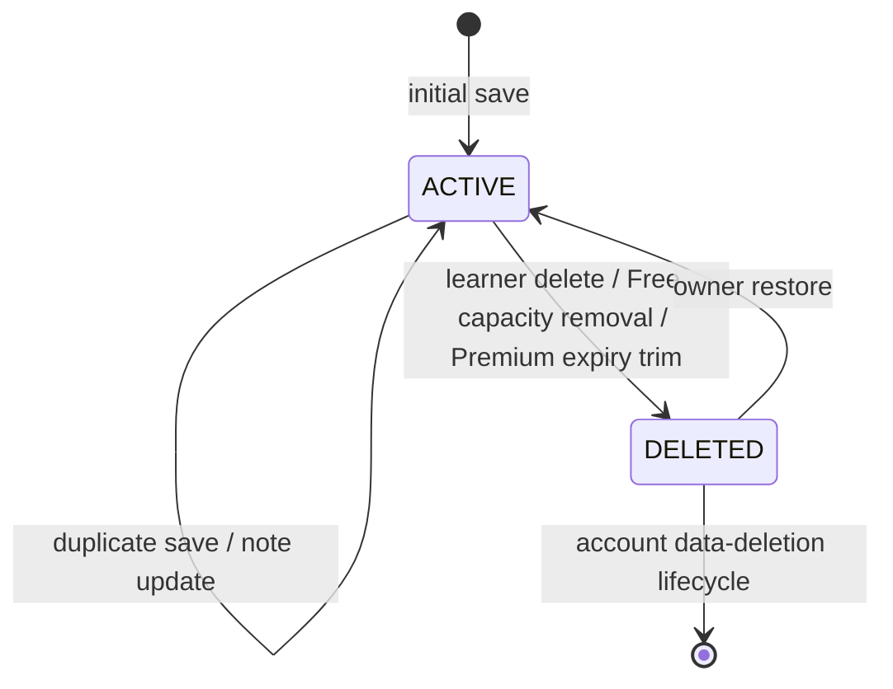

# Data Model: F09 Dictionary and Personal Vocabulary

`DATA_short.md` is the current schema source. Names below map to its canonical table and column names; the implementation migration adds only the constraints and derived projection required by F09 after checking deployed migration history.

## Dictionary source and search projection

### `dictionary_entries` (F04 authority)

| Field | F09 use |
| --- | --- |
| `dictionary_entry_id` | Stable identity for public detail, saved words and search keys. |
| `simplified_hanzi`, `traditional_hanzi` | Public Hanzi fields and source for normalized search keys. |
| `normalized_hanzi`, `normalized_pinyin` | Canonical normalized source values; pinyin removes tones, case and spacing variance. |
| `primary_pinyin`, `senses`, `hsk_level` | Public pinyin, Vietnamese meanings/examples and optional HSK filter. |
| `audio_media_asset_id`, `image_media_asset_id` | Public only when the F04 media asset is published and available. |
| `publication_state` | Only `PUBLISHED` is eligible for public detail/search and for a new save. |
| `version` | F04's content lifecycle concurrency control; it is not a saved-word note version. |

F09 never changes this table's content or publication state. A saved record may reference an entry that later becomes unpublishable; it remains private but its dictionary projection is `null` and `unavailable` is `true`.

### `dictionary_search_keys` (new derived projection)

| Column | Rules |
| --- | --- |
| `dictionary_entry_id` | FK to `dictionary_entries`; part of the key identity. |
| `query_kind` | `SIMPLIFIED_HANZI`, `TRADITIONAL_HANZI`, `PINYIN`, or `VIETNAMESE_KEYWORD`. |
| `normalized_key` | A bound lookup key: contiguous normalized Hanzi/pinyin candidate or normalized Vietnamese keyword. Never learner-private data. |
| `match_rank` | `WHOLE_FIELD`, `PREFIX`, `SUBSTRING`, or `KEYWORD`; duplicate candidates for an entry retain the strongest rank. |
| `created_at`, `updated_at` | Projection maintenance timestamps. |

Constraints and indexes:

- One row per `(dictionary_entry_id, query_kind, normalized_key)`.
- An index beginning with `(query_kind, normalized_key, match_rank, dictionary_entry_id)` supports an exact candidate lookup in ranking order.
- F04 content create/update/publish/unpublish rebuilds or removes affected rows in its transaction. Public search also joins the current entry and filters `PUBLISHED`, so projection lag cannot reveal content.
- `hsk_level` filters after published-entry validation. It accepts only 1–6 because that is the canonical dictionary range.

## `saved_words`

| Column | Rules |
| --- | --- |
| `saved_word_id` | UUID primary key; stable across learner deletion, automatic capacity removal and restoration. |
| `user_id` | FK to `users`; all reads and mutations require this owner. `ADMIN` has no bypass. |
| `dictionary_entry_id` | FK to the shared entry. Exactly one record may exist per learner/entry, regardless of status. |
| `personal_note_ciphertext` | Nullable encrypted optional plaintext note, maximum 500 Unicode code points. It is never indexed or logged. |
| `status` | F09 produces `ACTIVE` and `DELETED`. `ARCHIVED` remains reserved by the canonical schema and is not an F09 transition. |
| `saved_at` | Vocabulary recency. Set at initial successful save and each successful restoration to `ACTIVE`; unchanged by note edits and duplicate active saves. |
| `deleted_at` | Set whenever an active record becomes `DELETED`; cleared on restoration. |
| `created_at`, `updated_at` | Audit timestamps. `created_at` never changes on restoration. |
| `version` | Optimistic-lock version returned to the owner and required for note updates. |

Constraints and indexes:

- Unique `(user_id, dictionary_entry_id)` prevents duplicate logical words and schedules.
- Index `(user_id, status, saved_at, saved_word_id)` selects the Free capacity victim deterministically.
- A complementary descending index may be used for the Premium-expiry keep-newest query if `EXPLAIN` on the 100,000-entry fixture shows the ascending index is insufficient.
- The service locks the user before count/victim selection; the index is an efficiency tool, not the concurrency control.

## Saved-word state transitions

| Transition | `saved_at` | Note and F10 schedule |
| --- | --- | --- |
| Initial save | Set to server time | Optional note starts empty; F10 ensures one initial schedule. |
| Duplicate active save | Unchanged | No note or schedule mutation. |
| Note update | Unchanged | Requires matching `version`; stale request returns `409`. |
| Learner delete / capacity removal / expiry trim | Unchanged | Keep encrypted note; set `deleted_at`; F10 suspends existing schedule. |
| Restore | Set to server time | Clear `deleted_at`; retain note; F10 restores the existing schedule/history. |

When Free capacity is full, retain/activate the requested word and transition the oldest active word ordered by `saved_at ASC, saved_word_id ASC`. When Premium expires with more than 20 active words, retain the 20 newest ordered by `saved_at DESC, saved_word_id DESC`; transition all others to `DELETED`.

## Entitlement and F10 associations

### `user_entitlements` (F03 authority)

F09 reads the effective current plan only through F03. The existing `status`, `subscription_plan_id`, `starts_at`, `ends_at` and `version` support Free/Premium resolution. F03 must maintain at most one active entitlement per learner, enforced by a partial active-entitlement uniqueness index after data reconciliation. On expiry, F03 marks the Premium record terminal, establishes/reuses the Free record, then calls F09 capacity enforcement under the shared lock order.

### `srs_schedules` (F10 authority)

`srs_schedules.saved_word_id` has a unique association to this record. F09 calls F10 commands to ensure an initial schedule, suspend it or restore it. F09 neither stores duplicate due/interval/ease fields nor writes `srs_schedules` or `srs_review_events` directly.

## Owner API projections

The owner-visible saved-word projection returns `id`, `status`, `savedAt`, `version`, `personalNote`, `unavailable` and an optional safe dictionary summary. `dictionary` is `null` when the entry is not currently published. The list metadata returns the server-calculated active count and capacity (`20` for Free, `null` for Premium); it does not grant client authority to enforce either value.
